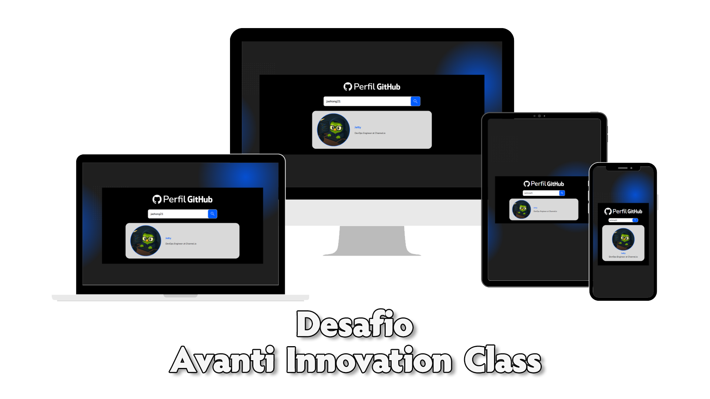

<div align="center">



</div>

</br>

</br>

# Sobre o projeto

### Descrição

Esse projeto consistiu na resolução de um um desafio técnico da <a href="https://ic.penseavanti.com.br/">Avanti Inovattion Class</a>, onde é proposto a criação de um site de busca de perfil do GitHub Durante esse projeto, pude fixar e aplicar conceitos fundamentais sobre *React*, tais como sintaxe, criação de componentes, *useEffects*, *useState* e *useRef*. Além disso, também tive contato com APIs, através da busca feita na API Users do GitHub para obtenção de dados de um usuário.


### Linguagens utilizadas


### Ferramentas utilizadas


</br>

</br>

# Instalação

Abra o terminal de sua IDE ou do próprio sistema operacional e , caso necessário, altere o diretório para o local onde você deseja instalar o repositório.

```
cd "diretorio-desejado"
```

Após isso, insira o comando para clonar o repositório para sua máquina local.

```
git clone https://github.com/lucas-lob/challenge-2-avanti-class.git
```

</br>

</br>

# Principais recursos desenvolvidos

### Requisição de API do GitHub

**Descrição:** Obtém dados a partir da requisição da API Users do GitHub. São extraídos, desses dados, a foto de perfil, nome e biografia do usuário.

**Conceitos aprendidos:** Pude aprender sobre requisições de API e arquivos JSON.


</br>

</br>

# Contatos

Contate-me através dos *links* abaixo!

<a href="https://www.linkedin.com/in/lucas-lobato-chagas-036159201/"></a>

E-mail: lucas.mcp23@gmail.com

